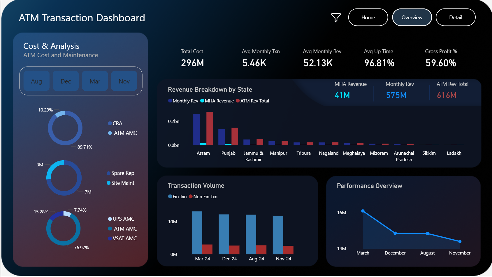
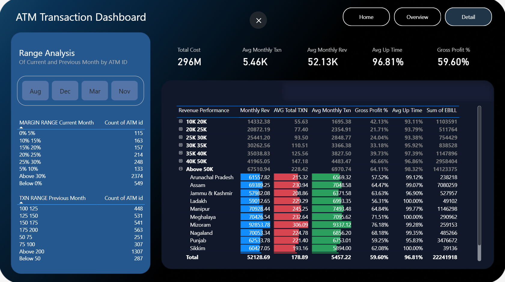

# ATM Performance Analysis (SQL + Power BI)

## Project Overview
This project analyzes ATM operational data to understand transaction patterns, revenue generation, operational costs, and profitability. SQL was used for exploratory data analysis and Power BI was used to build an interactive dashboard for visualization.

## Dataset
The dataset contains ATM operational metrics including:
- Financial and Non-Financial Transactions
- Monthly Revenue
- Operational Costs
- Gross Profit
- ATM Uptime
- ATM Type and Location

## Tools Used
- MySQL (SQL) – Data exploration and analysis
- Power BI – Dashboard creation and visualization
- Microsoft Excel – Data source

## SQL Analysis
SQL queries were used to analyze:
- Total transaction volume by ATM
- Revenue generated by ATMs
- Cost efficiency (Revenue vs Cost)
- Profitability analysis
- Transaction performance distribution
- ATM uptime performance

SQL file:[View SQL Analysis Queries](atm_analysis_queries.sql)

## Power BI Dashboard
The Power BI dashboard provides insights into:
- ATM transaction trends
- Revenue performance
- Profitability analysis
- Operational metrics

File:[Download Power BI Dashboard](ATM.pbix)

## Key Insights
- Identified high revenue generating ATMs
- Analyzed cost efficiency across ATM operations
- Evaluated ATM uptime performance
- Classified ATMs based on transaction activity

## Dashboard Preview

## Author
Ansal Mathew

